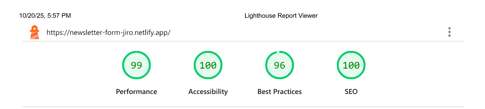

# Newsletter Sign-Up Form

## ADD PROJECT SUBTITLE

| _Mobile Preview (375x812)_                                   | _Desktop Preview (1440x960)_                                    |
| ------------------------------------------------------------ | --------------------------------------------------------------- |
|       |       |
|  |  |

INSERT A BRIEF DESCRIPTION OF THE PROJECT

Created as part of the building challenges from [Frontend Mentor](https://www.frontendmentor.io/).

---

## Overview

INSERT PROJECT OVERVIEW (1-2 PARAGRAPHS)

---

## Features

INSERT LIST OF PROJECT FEATURES

---

## Development Workflow

> Click to view the full branch and merge history

This project adapts a [granular branching and commit workflow](https://github.com/CodingWithJiro/frontend-mentor-newsletter-sign-up-form/network) to simulate team collaboration. Each feature, fix, documentation, and chore is tracked in its own branch with descriptive commits.

Each [pull request](https://github.com/CodingWithJiro/frontend-mentor-newsletter-sign-up-form/pulls?q=is%3Apr+is%3Aclosed) I created contains a clear description, change list, screenshots for UI updates, and reviewer notes.

_This ensures I maintain a professional workflow, even as a solo developer._

---

## What I Learned

INSERT LIST OF WHAT I LEARNED MAKING THIS PROJECT

---

## Tech Used

- HTML5
- CSS3
- JavaScript
- Git
- GitHub
- Netlify

---

## Design Reference & Tools

- JPG design image
- PerfectPixel

---

## How to Run

1. Clone the repository
2. Open `index.html` in your browser

---

## Live Demo

Or you can check out the [live website here](LINK)

---

## Performance Report

A **Google Lighthouse** audit was conducted on the final version of this project. You can view the full report [here](./assets/downloads/lighthouse-performance-report.pdf).

---

## Author

Created by **Elmar Chavez**

Month/Year: **October 2025**

Journey: **7th** month of learning _frontend web development_.
